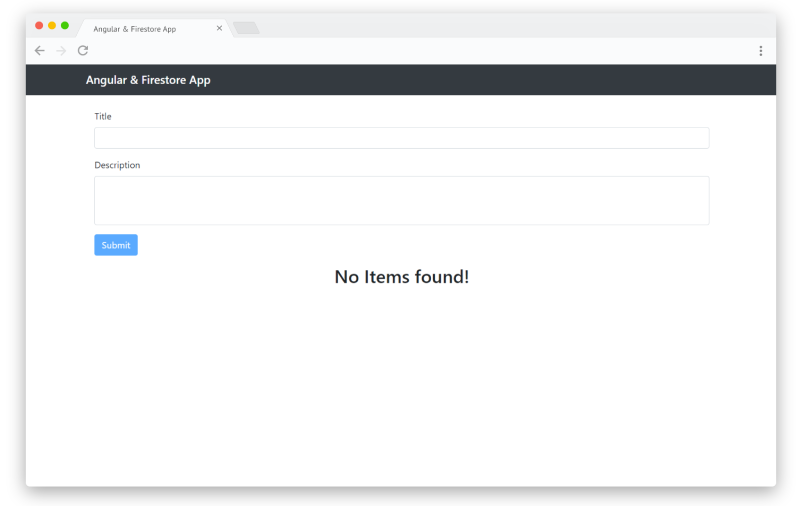

<div align="center">
  <h1>Angular & Firestore App</h1>
  
</div>

<div align="center">
<a href="https://angular-firestore-ba127.web.app/">https://angular-firestore-ba127.web.app/</a>
</div>

## Installing the Project
1. Clone this repo: `https://github.com/arongordos/angular-firestore-app.git` or [click here to download](https://github.com/arongordos/angular-firestore-app/archive/main.zip) the `zip` file.
2. `cd` into the folder
3. Run `npm install` to install the dependencies
4. Add your Firebase configuration to `environment.ts` or `environment.prod.ts` if you want to use it in production
```typescript
export const environment = {
  production: false,
  firebase: {
    apiKey: "",
    authDomain: "",
    projectId: "",
    storageBucket: "",
    messagingSenderId: "",
    appId: ""
  }
};
```

## Running the Project
Run `ng serve` for a dev server. Navigate to `http://localhost:4200/`. The app will automatically reload if you change any of the source files.

## Building the Project
Run `ng build` to build the project. The build artifacts will be stored in the `dist/` directory. Use the `--prod` flag for a production build.
